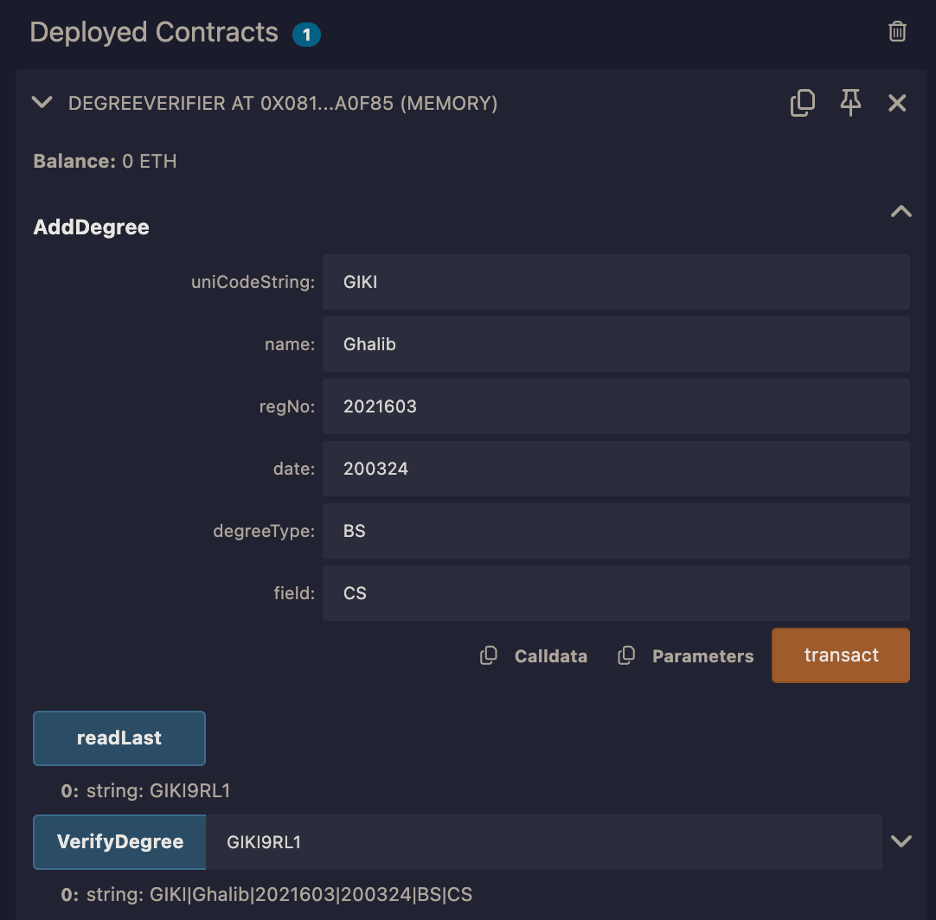
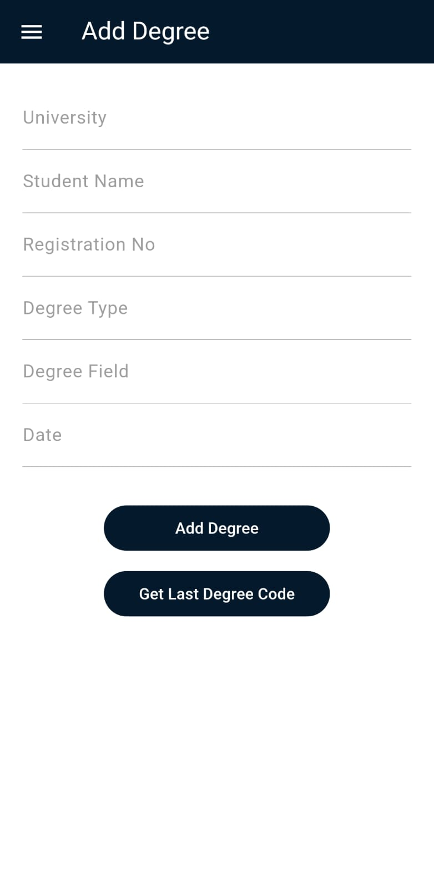
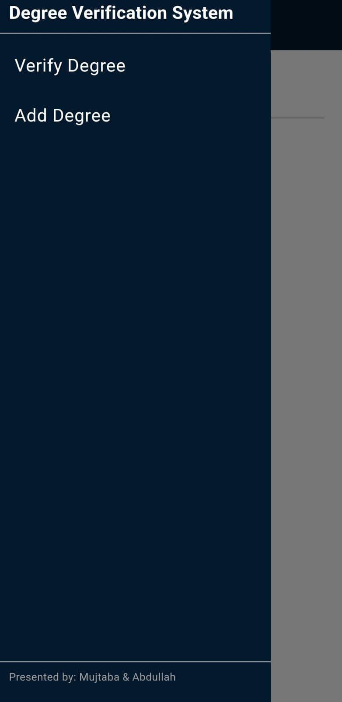
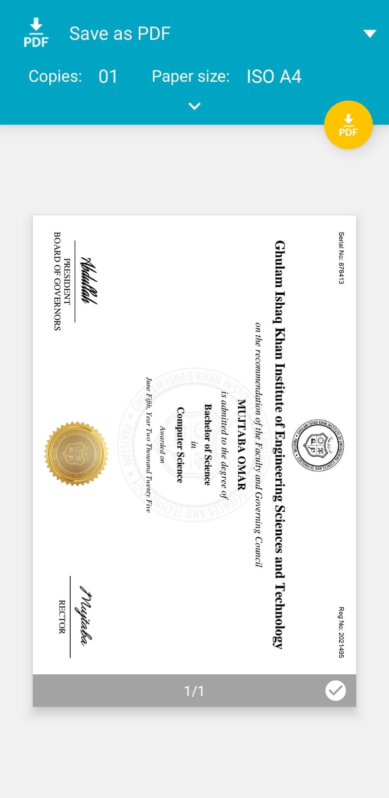

# Degree Verification Mobile App Based on Blockchain

## Introduction
The Degree Verification App is a decentralized solution built on blockchain technology to provide secure and tamper-proof validation of academic credentials. Using Ethereum smart contracts, it ensures that degree records are immutable and easily accessible by employers and educational institutions. The app is developed with Flutter, offering a seamless and user-friendly interface across mobile platforms. Blockchain's transparency and security make the verification process efficient, eliminating the need for manual checks. Users can verify and share their academic credentials with just a few taps. This app bridges the gap between traditional education and the modern digital world.

## Technologies

### Metamask 
MetaMask is a crypto wallet and browser extension for managing Ethereum assets and interacting with DApps. It securely stores private keys and connects to blockchain networks. Users can handle transactions, tokens, and smart contracts easily.

Install the Metamask extension on your browser and create an account.

### Ethereum Sepolia 
Sepolia is a testnet for Ethereum, designed to allow developers to deploy and test smart contracts without incurring high costs. It closely mirrors the mainnet environment, providing a reliable space for experimentation. Sepolia uses its native testnet Ether (tETH), which has no real-world value and can be obtained from faucets.

You can use Google's [faucet](https://cloud.google.com/application/web3/faucet/ethereum/sepolia) to get 0.05 Sepolia ETH in your Ethereum wallet once in 24 hours.

### Solidity
Solidity is a high-level programming language used to write smart contracts on Ethereum and other blockchain platforms. It is statically typed and designed to work with the Ethereum Virtual Machine (EVM), enabling decentralized applications (DApps).

The `lib/backend.sol` file is written in Solidity and contains the smart contract code for the project.

### Remix IDE
Remix IDE is a web-based development environment for writing, testing, and deploying Solidity smart contracts. It provides tools for debugging and compiling contracts, making it essential for Ethereum developers.

The `lib/backend.sol` file can be compiled and deployed on the Remix IDE. This is the backend code of the project.

<p align="center">
    
</p>

### Flutter 
Flutter is an open-source UI framework developed by Google for building natively compiled applications for mobile, web, and desktop from a single codebase. It uses the Dart programming language and provides rich pre-built widgets for fast development.

<p align="center">
  
  
  
  
  
</p>

## Instructions

In `lib/Config`, make a file named `secrets.dart` and add the following code:

```dart
Map<String,String> secrets =
{
  "web3Client": "", // Your Sepolia endpoint, instructions below
  "contractAddress": "0xfA9AedE59c6b99f5f3F36E2848E790737Ff67b38", // contract address
  "privateKey": "" // Your private key, instructions below
};
```

For `web3Client`, create an account on `https://developer.metamask.io/register` , create an API key and get your unique Sepolia endpoint (e.g., `https://sepolia.infura.io/v3/<your_project_id>`).

For `privateKey`, Open your Metamask extension > Select an Account > Account Details > Show Private Key

After that, you can enable USB debugging on your mobile, connect it with a USB to your computer and run the project with `flutter run`.
To build the apk, use `flutter build apk --release`.
